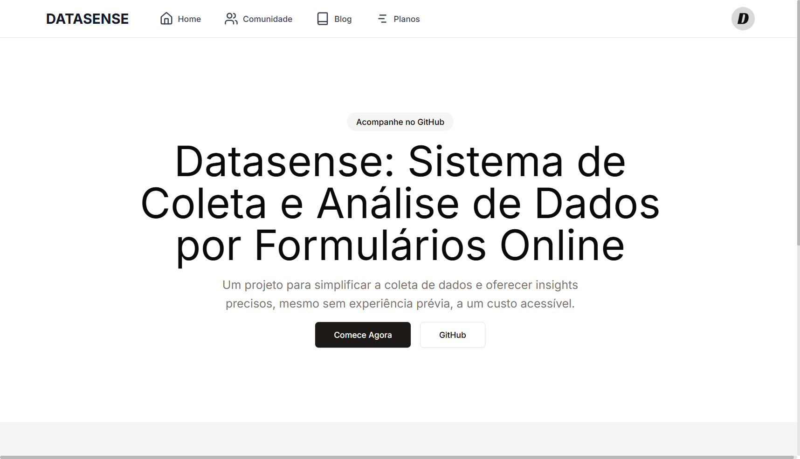
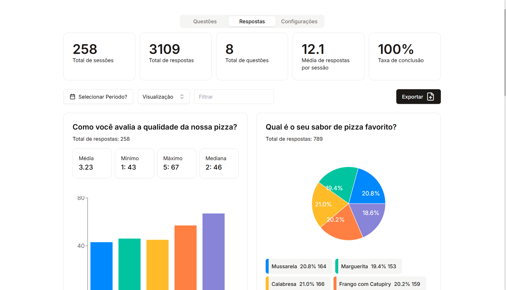
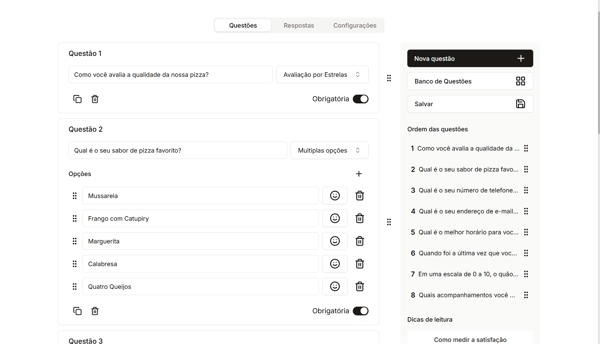
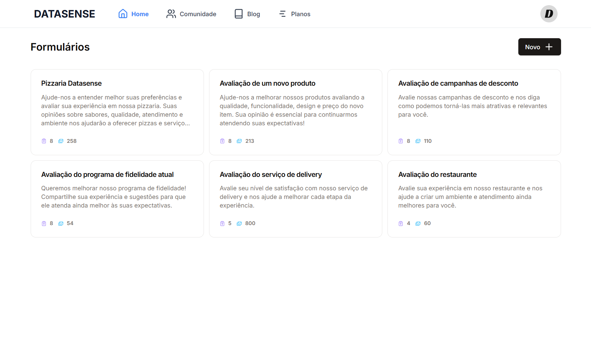
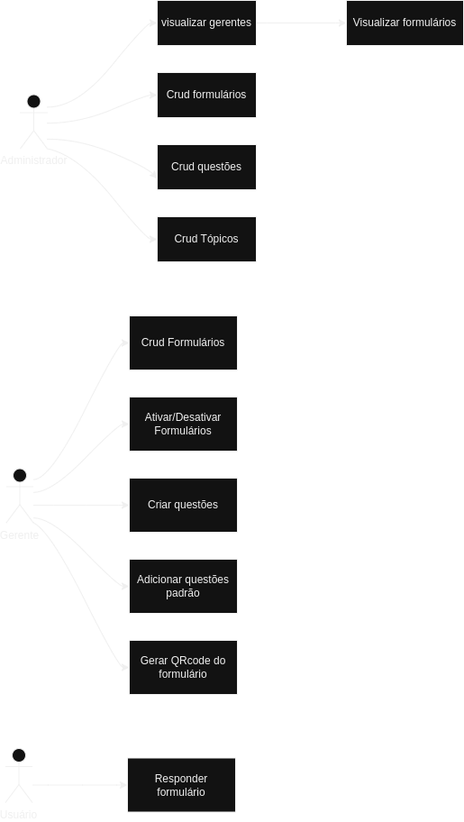
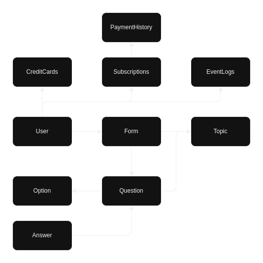
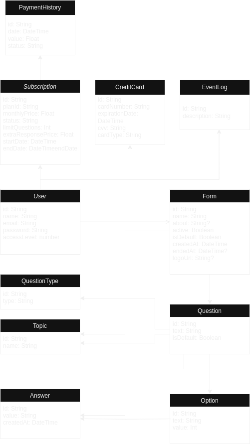
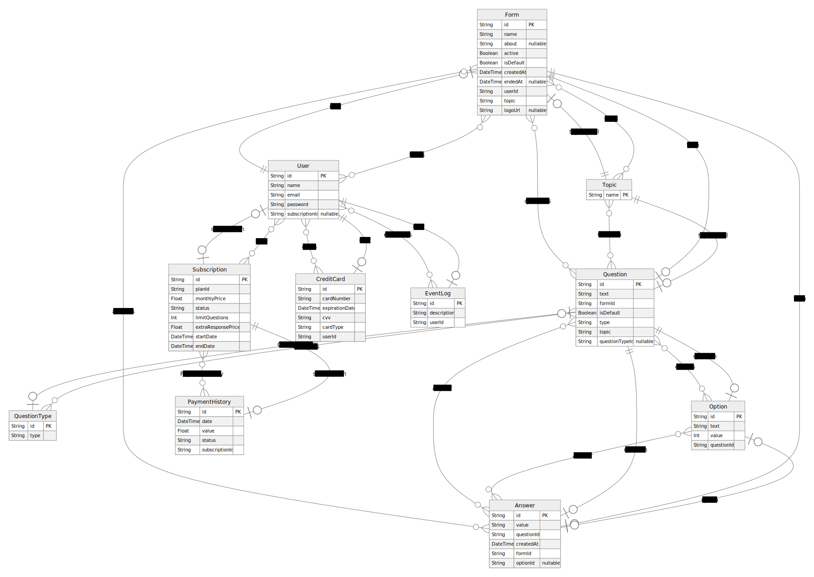

# DATASENSE



**Plataforma para criação de formulários e análise inteligente de dados.**

Datasense é uma aplicação web desenvolvida como Trabalho de Conclusão de Curso, com o objetivo de facilitar a coleta, organização e visualização de dados a partir de formulários personalizados.
O objetivo do projeto é disponibilizar uma forma apurada e precisa de coletar e analisar dados de pesquisas de mercado em geral, sem a necessidade de experiencia previa na area, disponibilizando modelos testados e aprovados, por um preço acessível.

## Funcionalidades

- Criação e gerenciamento de formulários dinâmicos
- Visualização de respostas com gráficos e dashboards
- Filtros avançados para análise segmentada
- Exportação de dados (.csv)
- Autenticação com JWT
- UI responsiva e acessível

## Tecnologias utilizadas

- **Frontend:** React.js, Next.js, Tailwind CSS, React Hook Form, Chart.js
- **Backend:** Node.js, Express.js, Prisma ORM
- **Banco de Dados:** PostgreSQL
- **Autenticação:** JWT
- **Outros:** GitHub, Vercel

## Público alvo 

- Gerentes de empresas de pequeno e médio porte que desejam conhecer melhor seu cliente
- Gerentes de empresas de pequeno e médio porte que desejam conhecer seus próprios funcionários e aplicar questionários internos

## Principais dores que o projeto resolve 

A incapacidade do gerente de conhecer seu cliente e suas necessidades
O custo elevado para se contratar agências de publicidade e marketing


## 📦 Como rodar o projeto localmente

1. Clone o repositório:
```bash
git clone <https://github.com/reciokaue/datasense.git>
```
2. Instale as dependências
```bash
yarn
```
3. Atualize o `.env`
```bash
  NEXT_PUBLIC_API_URL=http://localhost:3333
  NEXT_PUBLIC_APP_URL=http://localhost:3000
```
3. Atualize o `.env`
```bash
  NEXT_PUBLIC_API_URL=http://localhost:3333
  NEXT_PUBLIC_APP_URL=http://localhost:3000
```
4. rode o backend 

https://github.com/reciokaue/feed-back


# Aplicação







## Casos de uso



## Modelo de entidade e relacionamento ER



## Modelo de entidade e relacionamento ER




## Modelo ERD


