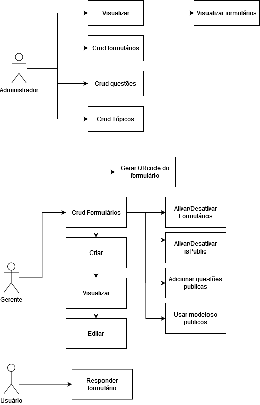

# DATASENSE

Sistema de captação e analise de dados através de formulários online

Grupo:  

- Kauê Recio Carpim Sala.  
- Leonardo Marcel Hyppolito.  

## Tecnologias: 

- React. 
- Node. 

O objetivo do projeto é disponibilizar uma forma apurada e precisa de coletar e analisar dados de pesquisas de mercado em geral, sem a necessidade de experiencia previa na area, disponibilizando modelos testados e aprovados, por um preço acessível

## Público alvo 

- Gerentes de empresas de pequeno e médio porte que desejam conhecer melhor seu cliente
- Gerentes de empresas de pequeno e médio porte que desejam conhecer seus próprios funcionários e aplicar questionários internos

## Principais dores que o projeto resolve 

A incapacidade do gerente de conhecer seu cliente e suas necessidades
O custo elevado para se contratar agências de publicidade e marketing

## Formas de Monetização

- Cobrança por pesquisa respondida
- Anúncios
- Planos

### Plano Gratuito:
- **Preço:** R$000,00
- **Recursos incluídos:**
  - Limite de questionários: 1
  - Limite de respostas por mês: 100
  - Exportação de dados (PDF)
  - Anúncios nos questionários

### Plano Básico:
- **Preço Mensal:** R$100,00
- **Recursos incluídos:**
  - Limite de questionários: 3
  - Limite de respostas por mês: 1000
  - Preço por resposta extra: R$0,85
  - Suporte ao cliente por email
  - Sem anúncios nos questionários

### Plano Premium:
- **Preço Mensal:** R$200,00
- **Recursos incluídos (além dos recursos do Plano Básico):**
  - Limite de questionários: 10
  - Limite de respostas por mês: 5,000
  - Preço por resposta extra: R$0,50
  - Suporte ao cliente 24 horas por dia por email
  - Personalização de logotipo
  - Análise automática das respostas

## Requisitos da primeira versão (MVP):
 
- O gerente deve conseguir selecionar questões/formulários prontos para criar seu formulário. 
- O gerente deve conseguir ativar e desativar formulários. 
- O gerente deve conseguir criar as questões do seu formulário. 
- O gerente deve selecionar uma data limite para formulários. 
- O usuário deve conseguir responder os formulários. 
- O administrador deve conseguir visualizar os gerentes e seus formulários. 
- O administrador deve conseguir criar e editar questões.
- O administrador deve conseguir criar e editar tópicos.
- O sistema deve salvar formulários inativos. 
- O sistema deve apresentar os resultados dos formulários. 
- O sistema deve gerar um qrCode e um link de acesso à formulário. 

## Observações:

- O gerente só pode alterar questões de um formulário se este não tiver respostas. 
- O sistema deve armazenar as datas e os horários das respostas dos usuários. 
- O gerente pode escolher a ordem das perguntas. 

## Perfis:

#### Usuário
  Permite responder os formulários

#### gerente:
  Permite criar e finalizar formulários
  Permite visualizar dados dos formulários
  Permite personalizar perguntas do formulário

#### Administrador.
  Permite visualizar usuários
  Permite visualizar formulários
  Permite criar e editar tópicos
  Permite criar e editar questões

## Responsividade
  Ter o layout correto para telas abaixo de 450px ao responder formulários.
  Não considerar larguras menores que 350px.

## Casos de uso

## Modelo de entidade e relacionamento ER

## Modelo de entidade e relacionamento ER

## Modelo ERD

## Wireframe

[Ver wireframe completo](https://www.figma.com/file/MLQHokmbohaa13met0GY9v/Feedback-VIew?type=design&mode=design&t=jsagiL4DEpiH0PK1-0)
